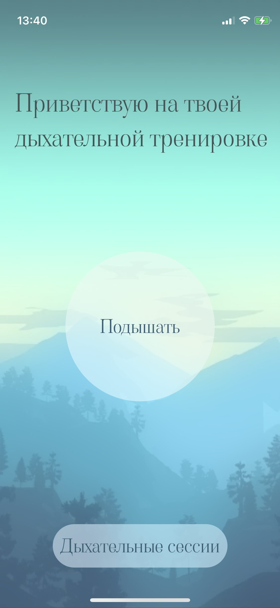
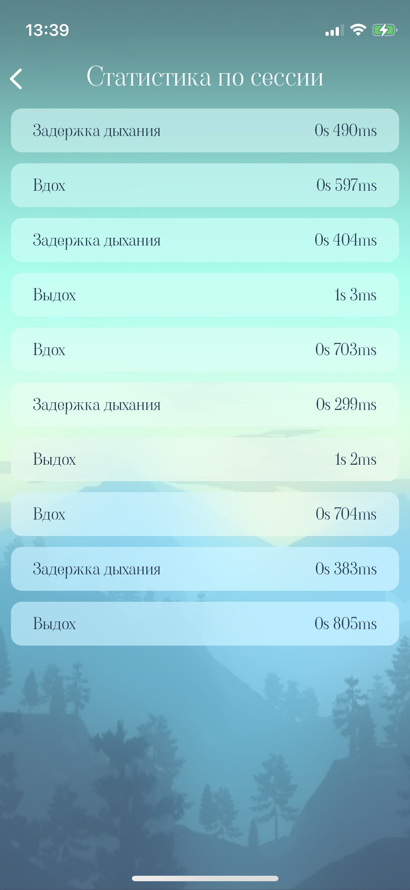
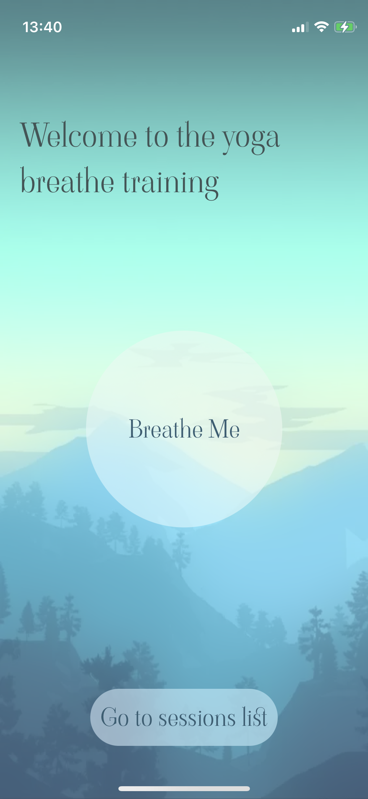
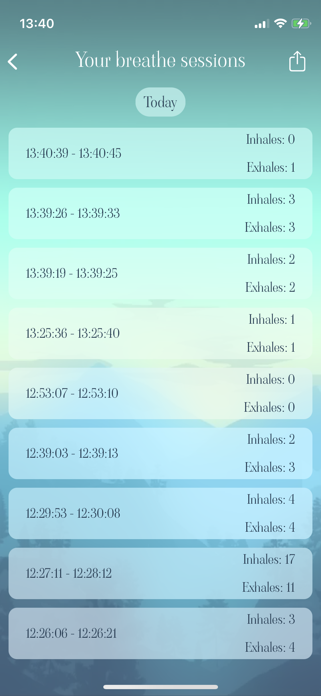
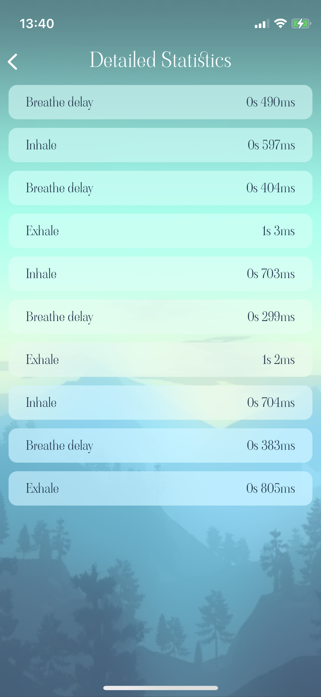

# Breathe Me

An app for iOS, that helps you to control your breath during yoga lessons. Just start the breathe session and breathe right into a microphone!

Also you can simply get your previous breathe sessions, get detailed statistics (number of inhalex, exhales and delays between them), and share it with your coach.

An app was made specially for [Yandex Cup 2021](https://yandex.ru/cup/)

## Screenshots

Russian language support

   
   
    

English language support

   
   
    

## Author
Denis Kovalev - den.kovalev999@gmail.com / bardgaming@yandex.ru

## Licence

BreatheMe is available under MIT licence. See the [LICENSE](LICENCE.md) file for more info.
